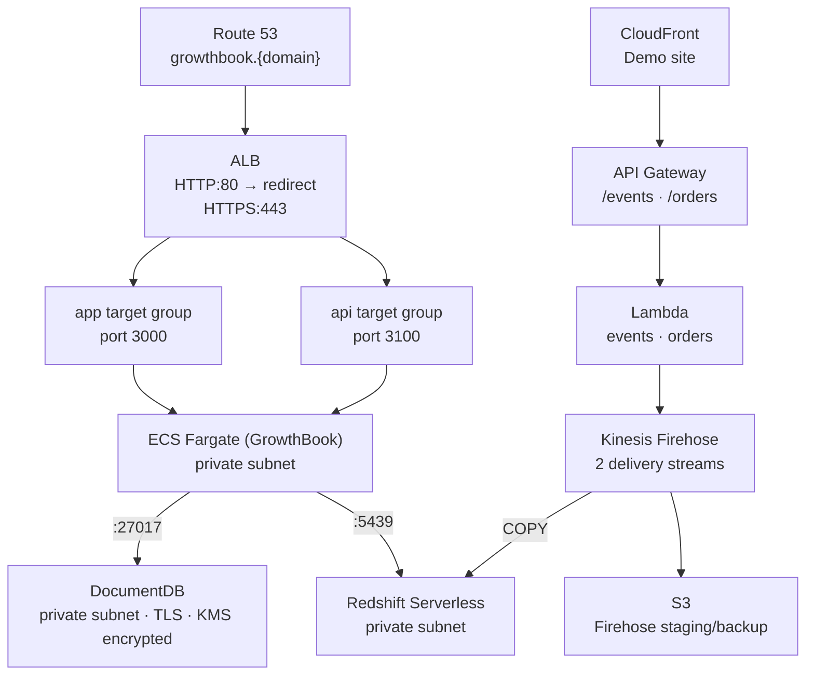

# AWS Growthbook Platform

## Table of Contents

1. [Overview](#overview)
2. [Architecture](#architecture)
3. [Setup](#setup)
4. [Tear Down](#tear-down)
5. [Pricing](#pricing)

## Overview

This project is an investigation into using the GrowthBook experimentation platform on AWS.

It uses CDK to provision the services as described in the architecture below. This includes a full ECS Fargate setup with an Application Load Balancer, private DocumentDB cluster, and secure storage of secrets in SSM Parameter Store and KMS.

## Architecture



| Stack                     | Purpose                                                                        |
| ------------------------- | ------------------------------------------------------------------------------ |
| `CoreNetworkStack`        | VPC, 3 AZs, public/private subnets, NAT gateway, VPC endpoints                 |
| `SecretsStack`            | KMS key + SSM parameter stubs                                                  |
| `IamStack`                | ECS task/execution role scoped to SSM parameters + KMS key                     |
| `ECRStack`                | ECR repository for the GrowthBook image                                        |
| `ApplicationStack`        | ECS cluster, task definition, ALB, target groups, Route 53 records             |
| `DocumentDbStack`         | DocumentDB cluster (TLS, KMS encrypted, deletion protection)                   |
| `StreamingStorageStack`   | S3 bucket for Firehose staging and backup                                      |
| `RedshiftStack`           | Redshift Serverless namespace + workgroup, admin + growthbook_user secrets     |
| `FirehoseStack`           | Two Firehose delivery streams → Redshift (fact_events + fact_orders)           |
| `ApplicationLambdasStack` | Lambda functions that put records to Firehose                                  |
| `ApiGatewayStack`         | REST API exposing `/events`, `/orders`, `/health`                              |
| `FrontendStack`           | S3 + CloudFront demo site                                                      |
| `AutomationStack`         | CDK custom resources: generate secrets, init MongoDB connection, init Redshift |

## Setup

### 1. Push the GrowthBook image to ECR

Deploy `ECRStack` first to create the repository, then push the image before deploying `ApplicationStack`.

```sh
pnpm cdk deploy ECRStack
aws ecr get-login-password --region eu-west-1 | \
  docker login --username AWS --password-stdin ACCOUNT_ID.dkr.ecr.eu-west-1.amazonaws.com
docker pull growthbook/growthbook:latest
docker tag growthbook/growthbook:latest ACCOUNT_ID.dkr.ecr.eu-west-1.amazonaws.com/growthbook:latest
docker push ACCOUNT_ID.dkr.ecr.eu-west-1.amazonaws.com/growthbook:latest
```

### 2. Deploy all stacks

```sh
pnpm cdk deploy --all --context domain=<REPLACE_WITH_DOMAIN>
```

### 3. Wire the API key to the demo frontend

The `/events` and `/orders` endpoints require an API key. After the first deploy, retrieve the key value and redeploy `FrontendStack` with it so the demo site can send requests:

```sh
KEY_ID=$(aws cloudformation describe-stacks --stack-name ApiGatewayStack \
  --query 'Stacks[0].Outputs[?OutputKey==`ApiKeyId`].OutputValue' --output text)

API_KEY=$(aws apigateway get-api-key --api-key-id "$KEY_ID" --include-value \
  --query value --output text)

pnpm cdk deploy FrontendStack \
  --context domain=<REPLACE_WITH_DOMAIN> \
  --context apiKey="$API_KEY"
```

### 4. Set email credentials

`AutomationStack` auto-generates `ENCRYPTION_KEY`, `JWT_SECRET`, and the MongoDB connection string on first deploy. The only values you still need to set manually are the SES SMTP credentials:

```sh
aws ssm put-parameter --name "/growthbook/production/email/username" --value "<SES_SMTP_USERNAME>" --type String --overwrite
aws ssm put-parameter --name "/growthbook/production/email/password" --value "<SES_SMTP_PASSWORD>" --type String --overwrite
```

After updating these, force a new ECS deployment to pick them up:

```sh
aws ecs update-service --cluster <CLUSTER_NAME> --service growthbook --force-new-deployment
```

### 5. Connect GrowthBook to Redshift

In GrowthBook, go to **Settings → Data Sources → Add Data Source → Redshift**.

Retrieve the `growthbook_user` password from Secrets Manager:

```sh
aws secretsmanager get-secret-value \
  --secret-id $(aws cloudformation describe-stacks --stack-name RedshiftStack \
    --query 'Stacks[0].Outputs[?OutputKey==`GrowthbookUserSecretArn`].OutputValue' --output text) \
  --query SecretString --output text | python3 -c "import sys,json; print(json.load(sys.stdin)['password'])"
```

Use the workgroup endpoint from the `RedshiftStack` CloudFormation output (`WorkgroupEndpoint`):

| Field    | Value                                   |
| -------- | --------------------------------------- |
| Host     | `<WorkgroupEndpoint>` (from CFN output) |
| Port     | `5439`                                  |
| Database | `analytics`                             |
| User     | `growthbook_user`                       |
| Password | retrieved from Secrets Manager (above)  |
| Schema   | `experimentation`                       |

### 6. Create GrowthBook fact tables

After connecting the data source, create two fact tables in GrowthBook (**Data Sources → [your source] → Add Fact Table**):

**fact_events** — raw event stream for behavioural metrics:

```sql
SELECT timestamp, user_id, anonymous_id, event_type, page_path, device_type
FROM experimentation.fact_events
```

Suggested metrics: Add to Cart Rate (filter `event_type = 'add_to_cart'`), Signup Rate (filter `event_type = 'signup'`), Page Views per User.

**fact_orders** — purchase events for revenue metrics:

```sql
SELECT timestamp, user_id, anonymous_id, amount, currency, device_type, coupon_code
FROM experimentation.fact_orders
```

Suggested metrics: Conversion Rate (Proportion), Revenue per User (Mean → `SUM(amount)`), Average Order Value (Ratio → `SUM(amount) / COUNT(*)`).

## Tear Down

DocumentDB has deletion protection enabled — disable it first:

```sh
aws docdb modify-db-cluster --db-cluster-identifier CLUSTER_ID --no-deletion-protection
pnpm cdk destroy --all
```

The KMS key and ECR repository have `RemovalPolicy.RETAIN` and must be cleaned up manually.

You can delete the rest of the resources with:

```sh
pnpm cdk destroy --all
```

## Pricing

Rough monthly estimates at low-to-moderate load (eu-west-1, on-demand pricing). Treat these as order-of-magnitude; actual costs depend on traffic and data volume.

| Service             | Config                           | Est. cost/month                    |
| ------------------- | -------------------------------- | ---------------------------------- |
| ECS Fargate         | 0.25 vCPU / 0.5 GB, 1 task 24/7  | ~$9                                |
| DocumentDB          | db.t3.medium, 1 instance         | ~$60                               |
| Redshift Serverless | 8 RPU base capacity              | ~$175 idle, scales with query time |
| ALB                 | 1 LCU/hr baseline                | ~$20                               |
| NAT Gateway         | 1 AZ, low traffic                | ~$35                               |
| Kinesis Firehose    | 2 streams, ~1M records/day       | ~$3                                |
| API Gateway         | REST, ~1M requests/day           | ~$3.50                             |
| Lambda              | 2 functions, ~1M invocations/day | ~$2                                |
| S3                  | Firehose backup + frontend       | < $1                               |
| CloudFront          | Low traffic                      | < $1                               |
| CloudWatch          | Logs, alarms across all streams  | ~$2                                |
| **Total**           |                                  | **~$315/month**                    |

The dominant costs are DocumentDB (~19%) and Redshift (~55%). To reduce spend:

- Replace DocumentDB with MongoDB Atlas free tier and remove the cluster entirely
- Scale Redshift RPUs down to 4 if query performance allows
- Remove the NAT Gateway by adding VPC endpoints for the remaining services
