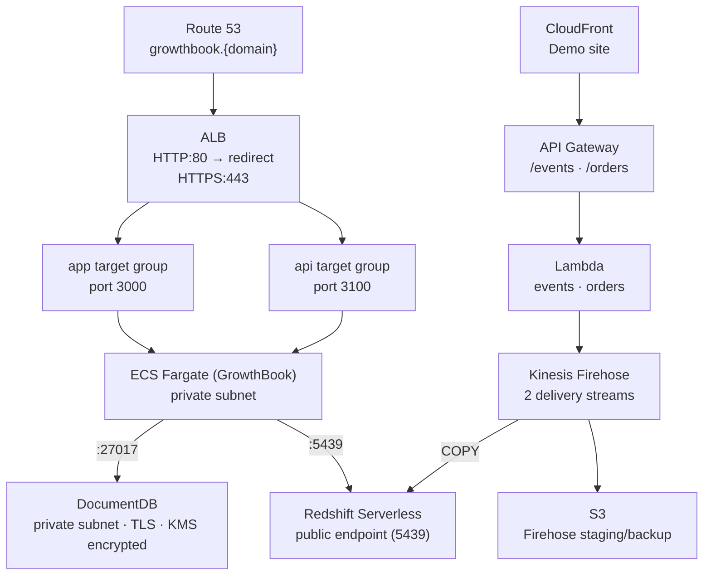

# AWS GrowthBook Platform

## Table of Contents

1. [Overview](#overview)
2. [Architecture](#architecture)
3. [Setup](#setup)
4. [GrowthBook Workflow](#growthbook-workflow)
5. [Tear Down](#tear-down)
6. [Pricing](#pricing)

## Overview

This project is an investigation into using the GrowthBook experimentation platform on AWS.

It uses CDK to provision the services as described in the architecture below. This includes a full ECS Fargate setup with an Application Load Balancer, private DocumentDB cluster, and secure storage of secrets in SSM Parameter Store and KMS.

## Architecture



| Stack                     | Purpose                                                                        |
| ------------------------- | ------------------------------------------------------------------------------ |
| `CoreNetworkStack`        | VPC, 3 AZs, public/private subnets, NAT gateway, VPC endpoints                 |
| `SecretsStack`            | KMS key + SSM parameter stubs                                                  |
| `IamStack`                | ECS task/execution role scoped to SSM parameters + KMS key                     |
| `ECRStack`                | ECR repository for the GrowthBook image                                        |
| `ApplicationStack`        | ECS cluster, task definition, ALB, target groups, Route 53 records             |
| `DocumentDbStack`         | DocumentDB cluster (TLS, KMS encrypted, deletion protection)                   |
| `StreamingStorageStack`   | S3 bucket for Firehose staging and backup                                      |
| `RedshiftStack`           | Redshift Serverless namespace + workgroup, admin + `growthbook_user` secrets   |
| `FirehoseStack`           | Two Firehose delivery streams → Redshift (`fact_events` + `fact_orders`)       |
| `ApplicationLambdasStack` | Lambda functions that put records to Firehose                                  |
| `ApiGatewayStack`         | REST API exposing `/events`, `/orders`, `/health`                              |
| `FrontendStack`           | S3 + CloudFront demo site                                                      |
| `AutomationStack`         | CDK custom resources: generate secrets, init MongoDB connection, init Redshift |

NOTE: Redshift is configured with a public endpoint on port `5439` so managed Firehose delivery streams can connect over JDBC. This is not ideal for production, you probably want to use S3 as an intermediary and keep Redshift in private subnets. However, this adds complexity to the setup so for the sake of this spike we allow public connectivity but restrict it with security groups.

## Setup

### 1. Authenticate with an AWS profile

```bash
export AWS_PROFILE=<REPLACE_WITH_PROFILE_NAME>
export AWS_REGION=eu-west-1
# One-time only if the profile is not already configured:
# aws configure --profile "$AWS_PROFILE"
aws sts get-caller-identity --profile "$AWS_PROFILE" >/dev/null
export AWS_ACCOUNT_ID=$(aws sts get-caller-identity --profile "$AWS_PROFILE" --query Account --output text)
```

### 2. Push the GrowthBook image to ECR

Deploy `ECRStack` first to create the repository, then push the image before deploying the rest of the stacks.

```sh
pnpm cdk deploy ECRStack --profile "$AWS_PROFILE" -c onlyStack=ECRStack -c region="$AWS_REGION"
aws ecr get-login-password --profile "$AWS_PROFILE" --region "$AWS_REGION" | \
  docker login --username AWS --password-stdin "$AWS_ACCOUNT_ID.dkr.ecr.$AWS_REGION.amazonaws.com"
docker build --platform linux/amd64 -t growthbook-custom ./docker
docker tag growthbook-custom:latest "$AWS_ACCOUNT_ID.dkr.ecr.$AWS_REGION.amazonaws.com/growthbook:latest"
docker push "$AWS_ACCOUNT_ID.dkr.ecr.$AWS_REGION.amazonaws.com/growthbook:latest"
```

### 3. Deploy all stacks

No custom domain (ALB DNS + CloudFront generated domain):

```sh
pnpm cdk deploy --all --profile "$AWS_PROFILE" -c region="$AWS_REGION"
```

Optionally, if you want a custom domain (Route53 + ACM + HTTPS):

```sh
pnpm cdk deploy --all --profile "$AWS_PROFILE" --context domain=<REPLACE_WITH_DOMAIN> -c region="$AWS_REGION"
```

### 4. Wire the API key into the demo frontend

The `/events` and `/orders` endpoints require an API key. After the first deploy, retrieve the key value and redeploy `FrontendStack` with it so the demo site can send traffic.

```sh
KEY_ID=$(aws cloudformation describe-stacks --profile "$AWS_PROFILE" --region "$AWS_REGION" --stack-name ApiGatewayStack \
  --query 'Stacks[0].Outputs[?OutputKey==`ApiKeyId`].OutputValue' --output text)

API_KEY=$(aws apigateway get-api-key --profile "$AWS_PROFILE" --region "$AWS_REGION" --api-key "$KEY_ID" --include-value \
  --query value --output text)

pnpm cdk deploy FrontendStack \
  --profile "$AWS_PROFILE" \
  --context apiKey="$API_KEY" \
  -c region="$AWS_REGION"
```

You should then be able to access the demo site (CloudFront or ALB URL depending on your setup). From there you can trigger some events and orders to see them flow through to Redshift and into GrowthBook.

### 5. Set email credentials (optional)

`AutomationStack` auto-generates `ENCRYPTION_KEY`, `JWT_SECRET`, and the MongoDB connection string on first deploy. The remaining manual values are the SES SMTP credentials:

```sh
aws ssm put-parameter --profile "$AWS_PROFILE" --region "$AWS_REGION" --name "/growthbook/production/email/username" --value "<SES_SMTP_USERNAME>" --type String --overwrite
aws ssm put-parameter --profile "$AWS_PROFILE" --region "$AWS_REGION" --name "/growthbook/production/email/password" --value "<SES_SMTP_PASSWORD>" --type String --overwrite
```

After updating these, force a new ECS deployment to pick them up:

```sh
aws ecs update-service --profile "$AWS_PROFILE" --region "$AWS_REGION" --cluster <CLUSTER_NAME> --service growthbook --force-new-deployment
```

### 6. Connect GrowthBook to Redshift

In GrowthBook, go to **Metrics and Data → Data Sources → Add Data Source → Redshift**.

Retrieve the `growthbook_user` password from Secrets Manager:

```sh
aws secretsmanager get-secret-value \
  --profile "$AWS_PROFILE" \
  --region "$AWS_REGION" \
  --secret-id $(aws cloudformation describe-stacks --profile "$AWS_PROFILE" --region "$AWS_REGION" --stack-name RedshiftStack \
    --query 'Stacks[0].Outputs[?OutputKey==`GrowthbookUserSecretArn`].OutputValue' --output text) \
  --query SecretString --output text | python3 -c "import sys,json; print(json.load(sys.stdin)['password'])"
```

Use the Redshift workgroup endpoint from the `RedshiftStack` output:

| Field       | Value                                   |
| ----------- | --------------------------------------- |
| Host        | `<WorkgroupEndpoint>`                   |
| Port        | `5439`                                  |
| Database    | `analytics`                             |
| User        | `growthbook_user`                       |
| Password    | retrieved from Secrets Manager          |
| Schema      | `experimentation`                       |
| Require TLS | Yes                                     |

### 7. Use the demo frontend

The demo site keeps a sticky visitor context in local storage:

- Visitor identity: `user_id`, `anonymous_id`, `session_id`
- Dimensions: `device_type`, `country`, `referrer_domain`, `logged_in`, `page_path`, `page_category`
- Experiment tracking: `experiment_id`, `variation_id`
- Feature tracking: `feature_key`, `feature_value`

Use it like this:

- Open the CloudFront site from the `FrontendStack` output
- Adjust the visitor context if you want a specific country, device, or signed-in state
- Click **Send exposure** to emit an `experiment_viewed` event
- Click **Send feature usage** to emit a `feature_usage` event
- Click **Run burst** to generate a mixed journey of page views, exposures, feature usage, add-to-cart events, checkout starts, and orders

The generated demo experiment defaults to:

- Experiment key: `checkout-layout-aa`
- Feature key: `checkout-layout`
- Variation `0`: `classic`
- Variation `1`: `modern`

Both demo variations currently use the same conversion multiplier, so the default simulation behaves like an A/A test.

## GrowthBook Workflow

### What the warehouse contains

The platform initialises these Redshift objects for GrowthBook.

#### Raw fact tables

- `experimentation.fact_events`
- `experimentation.fact_orders`

#### Derived views

- `experimentation.experiment_assignments`
- `experimentation.viewed_experiment`
- `experimentation.feature_usage`
- `experimentation.session_metrics`
- `experimentation.checkout_funnel`
- `experimentation.user_day_metrics`

These are intended to cover the common GrowthBook workflow without extra modelling work in the UI.

### Configure the experiment assignment query

Use `experimentation.experiment_assignments` as the basis for your assignment query.

The view already exposes the core fields GrowthBook needs:

- `user_id`
- `anonymous_id`
- `timestamp`
- `experiment_id`
- `variation_id`

It also exposes useful exposure-time dimensions:

- `device_type`
- `country`
- `referrer_domain`
- `logged_in`
- `page_path`
- `page_category`

If you prefer custom SQL in GrowthBook, start from:

```sql
SELECT
  user_id,
  anonymous_id,
  timestamp,
  experiment_id,
  variation_id,
  device_type,
  country,
  referrer_domain,
  logged_in,
  page_path,
  page_category
FROM experimentation.experiment_assignments
```

### Create fact tables in GrowthBook

Create GrowthBook fact tables from the warehouse objects below.

#### `fact_events`

Use for behavioural metrics such as add-to-cart rate, signup rate, and page views per user.

```sql
SELECT
  user_id,
  anonymous_id,
  timestamp,
  event_type,
  page_path,
  page_category,
  device_type,
  country,
  referrer_domain,
  logged_in,
  experiment_id,
  variation_id,
  feature_key,
  feature_value
FROM experimentation.fact_events
```

#### `fact_orders`

Use for revenue and order metrics.

```sql
SELECT
  user_id,
  anonymous_id,
  session_id,
  timestamp,
  amount,
  currency,
  device_type,
  country,
  referrer_domain,
  logged_in,
  coupon_code,
  order_status
FROM experimentation.fact_orders
```

#### `session_metrics`

Use for session-based metrics and activation checks.

```sql
SELECT
  unit_id as user_id,
  anonymous_id,
  session_start_at as timestamp,
  device_type,
  country,
  referrer_domain,
  logged_in,
  event_count,
  page_views,
  add_to_carts,
  checkout_starts,
  signups
FROM experimentation.session_metrics
```

#### `checkout_funnel`

Use for conversion, funnel progression, and revenue per session.

```sql
SELECT
  unit_id as user_id,
  anonymous_id,
  session_start_at as timestamp,
  device_type,
  country,
  referrer_domain,
  logged_in,
  page_views,
  add_to_carts,
  checkout_starts,
  order_count,
  revenue,
  converted
FROM experimentation.checkout_funnel
```

#### `user_day_metrics`

Use for daily retention, activity, and revenue roll-ups.

```sql
SELECT
  unit_id as user_id,
  anonymous_id,
  activity_date as timestamp,
  device_type,
  country,
  referrer_domain,
  logged_in,
  sessions,
  page_views,
  add_to_carts,
  checkout_starts,
  signups,
  orders,
  revenue
FROM experimentation.user_day_metrics
```

### Suggested dimensions

Add dimensions from assignment-time attributes first. That keeps drill-downs closer to exposure time and avoids some obvious bias.

Recommended first dimensions:

- `device_type`
- `country`
- `referrer_domain`
- `logged_in`
- `page_category`

### Suggested metrics

Recommended first metrics in GrowthBook:

- **Add to Cart Rate** from `fact_events` with `event_type = 'add_to_cart'`
- **Signup Rate** from `fact_events` with `event_type = 'signup'`
- **Conversion Rate** from `checkout_funnel` using `converted`
- **Revenue per Session** from `checkout_funnel` using `revenue`
- **Orders per User** from `fact_orders`
- **Feature Adoption Rate** from `fact_events` or `feature_usage` filtered by `feature_key`
- **Sessions per User-Day** from `user_day_metrics`

### Recommended operating model

For this stack, the sensible first pass is:

- run an A/A experiment first using the demo experiment `checkout-layout-aa`
- keep the assignment query pointed at `experimentation.experiment_assignments`
- use sticky visitor IDs in the demo to validate assignment behaviour
- create dimensions from the assignment view before adding lots of metrics
- use namespaces in GrowthBook once multiple experiments overlap
- connect real applications with official GrowthBook SDKs, and treat this demo as a warehouse and event-model exercise

## Tear Down

DocumentDB has deletion protection enabled, so disable it first:

```sh
aws docdb modify-db-cluster --profile "$AWS_PROFILE" --region "$AWS_REGION" --db-cluster-identifier CLUSTER_ID --no-deletion-protection
pnpm cdk destroy --all --profile "$AWS_PROFILE" -c region="$AWS_REGION"
```

The KMS key and ECR repository use `RemovalPolicy.RETAIN` and must be cleaned up manually.

You can then destroy the rest of the stack:

```sh
pnpm cdk destroy --all --profile "$AWS_PROFILE" -c region="$AWS_REGION"
```

## Pricing

Rough monthly estimates at low-to-moderate load (eu-west-1, on-demand pricing). Treat these as order-of-magnitude; actual costs depend on traffic and data volume.

| Service             | Config                           | Est. cost/month                    |
| ------------------- | -------------------------------- | ---------------------------------- |
| ECS Fargate         | 1 vCPU / 2 GB, 1 task 24/7       | ~$36                               |
| DocumentDB          | db.t3.medium, 1 instance         | ~$60                               |
| Redshift Serverless | 8 RPU base capacity              | ~$175 idle, scales with query time |
| ALB                 | 1 LCU/hr baseline                | ~$20                               |
| NAT Gateway         | 1 AZ, low traffic                | ~$35                               |
| Kinesis Firehose    | 2 streams, ~1M records/day       | ~$3                                |
| API Gateway         | REST, ~1M requests/day           | ~$3.50                             |
| Lambda              | 2 functions, ~1M invocations/day | ~$2                                |
| S3                  | Firehose backup + frontend       | < $1                               |
| CloudFront          | Low traffic                      | < $1                               |
| CloudWatch          | Logs, alarms across all streams  | ~$2                                |
| **Total**           |                                  | **~$342/month**                    |

The dominant costs are DocumentDB (~19%) and Redshift (~55%). To reduce spend:

- Replace DocumentDB with MongoDB Atlas free tier and remove the cluster entirely
- Scale Redshift RPUs down to 4 if query performance allows
- Remove the NAT Gateway by adding VPC endpoints for the remaining services
