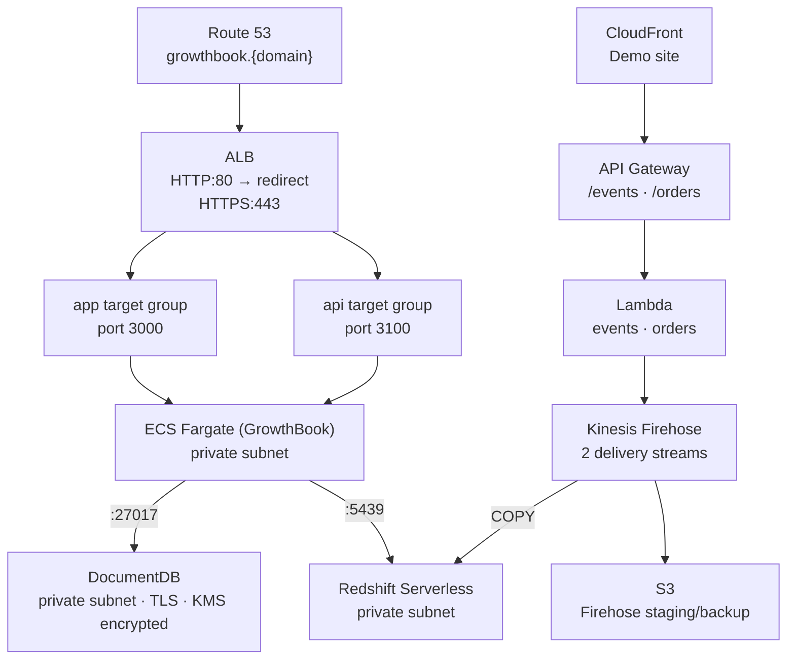

# AWS Growthbook Platform

## Table of Contents

1. [Overview](#overview)
2. [Architecture](#architecture)
3. [Setup](#setup)
4. [Tear Down](#tear-down)
5. [Pricing](#pricing)

## Overview

This project is an investigation into using the GrowthBook experimentation platform on AWS.

It uses CDK to provision the services as described in the architecture below. This includes a full ECS Fargate setup with an Application Load Balancer, private DocumentDB cluster, and secure storage of secrets in SSM Parameter Store and KMS.

## Architecture



| Stack                     | Purpose                                                              |
| ------------------------- | -------------------------------------------------------------------- |
| `CoreNetworkStack`        | VPC, 3 AZs, public/private subnets, NAT gateway, VPC endpoints       |
| `SecretsStack`            | KMS key + SSM parameter stubs                                        |
| `IamStack`                | ECS task/execution role scoped to SSM parameters + KMS key           |
| `ECRStack`                | ECR repository for the GrowthBook image                              |
| `ApplicationStack`        | ECS cluster, task definition, ALB, target groups, Route 53 records   |
| `DocumentDbStack`         | DocumentDB cluster (TLS, KMS encrypted, deletion protection)         |
| `StreamingStorageStack`   | S3 bucket for Firehose staging and backup                            |
| `RedshiftStack`           | Redshift Serverless namespace + workgroup, admin secret              |
| `FirehoseStack`           | Two Firehose delivery streams → Redshift (fact_events + fact_orders) |
| `ApplicationLambdasStack` | Lambda functions that put records to Firehose                        |
| `ApiGatewayStack`         | REST API exposing `/events`, `/orders`, `/health`                    |
| `FrontendStack`           | S3 + CloudFront demo site                                            |

## Setup

### 1. Push the GrowthBook image to ECR

Deploy `ECRStack` first to create the repository, then push the image before deploying `ApplicationStack`.

```sh
pnpm cdk deploy ECRStack
aws ecr get-login-password --region eu-west-1 | \
  docker login --username AWS --password-stdin ACCOUNT_ID.dkr.ecr.eu-west-1.amazonaws.com
docker pull growthbook/growthbook:latest
docker tag growthbook/growthbook:latest ACCOUNT_ID.dkr.ecr.eu-west-1.amazonaws.com/growthbook:latest
docker push ACCOUNT_ID.dkr.ecr.eu-west-1.amazonaws.com/growthbook:latest
```

### 2. Deploy all stacks

```sh
pnpm cdk deploy --all --context domain=<REPLACE_WITH_DOMAIN>
```

### 3. Populate SSM parameters

After `SecretsStack` deploys, update the placeholder values:

```sh
aws ssm put-parameter --name "/growthbook/production/encryptionKey" --value "<REPLACE_WITH_ENCRYPTION_KEY>" --type String --overwrite
aws ssm put-parameter --name "/growthbook/production/jwt" --value "<REPLACE_WITH_JWT>" --type String --overwrite
aws ssm put-parameter --name "/growthbook/production/email/username" --value "<REPLACE_WITH_EMAIL_USERNAME>" --type String --overwrite
aws ssm put-parameter --name "/growthbook/production/email/password" --value "<REPLACE_WITH_EMAIL_PASSWORD>" --type String --overwrite
```

### 4. Update the MongoDB connection string

After `DocumentDbStack` deploys, copy the cluster endpoint from the CloudFormation output. The DocumentDB master password is in Secrets Manager under `growthbook-platform/docdb-master-credentials`.

```sh
aws ssm put-parameter \
  --name "/growthbook/production/documentdb/dbstring" \
  --value "mongodb://docdbAdmin:<REPLACE_WITH_DOCDB_PASSWORD>@CLUSTER_ENDPOINT:27017/growthbook?tls=true&tlsCAFile=/etc/pki/tls/certs/ca-bundle.crt&replicaSet=rs0&readPreference=secondaryPreferred&retryWrites=false" \
  --type String --overwrite
```

Force a new deployment to pick up the updated parameter:

```sh
aws ecs update-service --cluster CLUSTER_NAME --service growthbook --force-new-deployment
```

Then wait for the deployment to finish before accessing the app at `https://growthbook.{domain}`.

### 5. Configure the Redshift cluster

After `RedshiftStack` deploys, connect via Redshift Query Editor using the admin credentials from Secrets Manager (`/{component}/redshift/admin`). Run:

```sql
CREATE SCHEMA IF NOT EXISTS experimentation;

CREATE TABLE IF NOT EXISTS experimentation.fact_events (
  event_id    VARCHAR(36),
  user_id     VARCHAR(255),
  anonymous_id VARCHAR(255),
  timestamp   TIMESTAMP,
  event_type  VARCHAR(255),
  page_path   VARCHAR(1024),
  session_id  VARCHAR(36),
  device_type VARCHAR(50),
  properties  VARCHAR(MAX)
);

CREATE TABLE IF NOT EXISTS experimentation.fact_orders (
  order_id    VARCHAR(36),
  user_id     VARCHAR(255),
  anonymous_id VARCHAR(255),
  timestamp   TIMESTAMP,
  amount      FLOAT8,
  currency    VARCHAR(3),
  device_type VARCHAR(50),
  coupon_code VARCHAR(100)
);

CREATE USER growthbook_user WITH PASSWORD '<REPLACE_ME>';
GRANT USAGE ON SCHEMA experimentation TO growthbook_user;
GRANT SELECT ON ALL TABLES IN SCHEMA experimentation TO growthbook_user;
ALTER DEFAULT PRIVILEGES IN SCHEMA experimentation GRANT SELECT ON TABLES TO growthbook_user;
```

### 6. Connect GrowthBook to Redshift

In GrowthBook, go to **Settings → Data Sources → Add Data Source → Redshift**.

Use the workgroup endpoint from the `RedshiftStack` CloudFormation output (`WorkgroupEndpoint`):

| Field    | Value                                   |
| -------- | --------------------------------------- |
| Host     | `<WorkgroupEndpoint>` (from CFN output) |
| Port     | `5439`                                  |
| Database | `analytics`                             |
| User     | `growthbook_user`                       |
| Password | password set in step 5                  |
| Schema   | `experimentation`                       |

### 7. Create GrowthBook fact tables

After connecting the data source, create two fact tables in GrowthBook (**Data Sources → [your source] → Add Fact Table**):

**fact_events** — raw event stream for behavioural metrics:

```sql
SELECT timestamp, user_id, anonymous_id, event_type, page_path, device_type
FROM experimentation.fact_events
```

Suggested metrics: Add to Cart Rate (filter `event_type = 'add_to_cart'`), Signup Rate (filter `event_type = 'signup'`), Page Views per User.

**fact_orders** — purchase events for revenue metrics:

```sql
SELECT timestamp, user_id, anonymous_id, amount, currency, device_type, coupon_code
FROM experimentation.fact_orders
```

Suggested metrics: Conversion Rate (Proportion), Revenue per User (Mean → `SUM(amount)`), Average Order Value (Ratio → `SUM(amount) / COUNT(*)`).

## Tear Down

DocumentDB has deletion protection enabled — disable it first:

```sh
aws docdb modify-db-cluster --db-cluster-identifier CLUSTER_ID --no-deletion-protection
pnpm cdk destroy --all
```

The KMS key and ECR repository have `RemovalPolicy.RETAIN` and must be cleaned up manually.

You can delete the rest of the resources with:

```sh
pnpm cdk destroy --all
```

## Pricing

TODO
